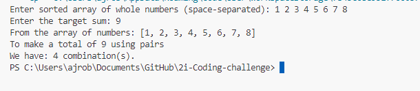

# 2i-Coding-challenge

## How To Run
1. Compile the java file by opening a terminal and running `javac challenge.java`
2. Run the program by entering `java challenge`
3. Follow the prompt to enter a list of space seperated whole numbers in asecnding order and press enter
4. Follow the prompt to enter the sum we want to find and press enter
5. The output will be printed

.

## Asumptions
- I've not added any error handling I'm assuming the user will only enter whole numbers and no blank spaces
- I've assumed we only want to run this program once otherwise I would have made it ask for another array after printing the output
- Assuming integers are big enough for the use case 
- No validation added to the numbers negative numbers will work e.g. if you have -1 2 3 and a sum of 2 -1+3 will be found as a match
